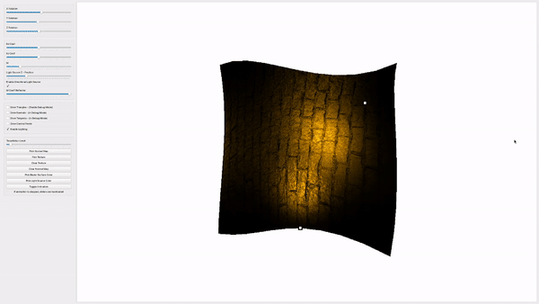
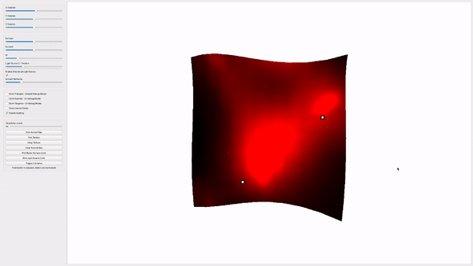
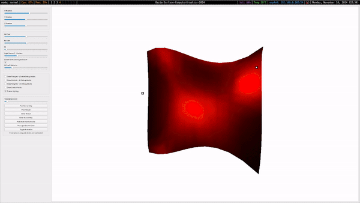

# Parallel CPU Rendering Engine in C++ with Qt

## Table of Contents

- [Parallel Rendering Engine in C++ with Qt](#parallel-rendering-engine-in-c-with-qt)
  - [Project Overview](#project-overview)
  - [Gifs](#gifs)
  - [Features](#features)
    - [Parallelized Rendering Pipeline](#parallelized-rendering-pipeline)
    - [Bezier Surface Input](#bezier-surface-input)
    - [Flexible 3D Transformations](#flexible-3d-transformations)
    - [Rendering Modes](#rendering-modes)
    - [Advanced Lighting Model](#advanced-lighting-model)
    - [Texture and Normal Mapping](#texture-and-normal-mapping)
    - [Animation Features](#animation-features)
    - [Multi-Resolution Canvas](#multi-resolution-canvas)
    - [ZBuffering](#zbuffering)
  - [File Input Format](#file-input-format)
  - [Requirements](#requirements)
    - [Software](#software)
    - [Libraries and Tools](#libraries-and-tools)
  - [Running the Application](#running-the-application)
    - [Steps to Build and Run](#steps-to-build-and-run)
    - [Additional Notes](#additonal-notes)

## Project Overview

This project is a simplified **rendering engine**, built in C++ and Qt, running entirely on the CPU with **parallelized rendering capabilities**. It supports:
- Multiple directed light sources.
- User-controlled triangulated meshes.
- ZBuffering.
- Texture and normal mapping.
- Concurrent rendering of scenes with a customizable canvas resolution.

The core feature of this engine is its ability to process 3D objects, represented as meshes of triangles, and render them efficiently using triangle rasterization techniques performed in parralell. While the primary object of interest is a 3rd-degree Bezier surface converted into a mesh via triangulation, the system is designed to handle any triangle-based mesh.

## Gifs






## Features

1. **Parallelized Rendering Pipeline**
   - The rasterization and lighting computation for individual triangles are executed concurrently using CPU threads.
   - The engine efficiently distributes rendering tasks across available CPU cores.

2. **Bezier Surface Input**
   - Reads 16 control points (x, y, z) from a text file to define a 3rd-degree Bezier surface.
   - The Bezier surface is:
     - Interpolated and triangulated into a mesh.
     - Designed to fit within a bounding box resembling a cube.
     - Easily drawable on a canvas centered at the origin.

3. **Flexible 3D Transformations**
   - Supports most 3d transformations such as 3D rotations
   - Triangles and their properties (vertices, tangents, normals) are transformed in 3D before rendering.
   - Orthographic projection is applied for 2D visualization.

4. **Rendering Modes**
   - **Wireframe Mode**: Displays only the triangulated mesh structure.
   - **Shaded Mode**: Renders filled triangles with applied textures and lighting.

5. **Advanced Lighting Model**
   - Integrates Lambertian and specular reflection for realistic shading:
     ```
     I = kd * IL_0 * IO_0 * cos(θ(N, L)) + ks * IL_0 * IO_0 * cos^m(θ(V, R)) +
         ... per light source ...
         kd * IL_n * IO_n * cos(θ(N, L)) + ks * IL_0 * IO_0 * cos^m(θ(V, R))
     ```
     - **Diffuse (`kd`)** and **specular (`ks`) coefficients** adjustable via sliders.
     - Fully supports multiple light sources with user-configured positions and colors.
     - Performs per-pixel shading based on interpolated normals and barycentric coordinates.

6. **Texture and Normal Mapping**
   - Adds realism through texture mapping (UV-based) and normal maps.
   - Normal mapping:
     - Adjusts per-pixel normals based on a transformation matrix and texture-derived vectors.
     - Supports user-specified normal maps in the RGB format.

7. **Animation Features**
   - Includes a moving light source that spirals in 3D space (constant Z-plane, adjustable via slider).
   - Users can pause and resume light source animations for static or dynamic scenes.

8. **Multi-Resolution Canvas**
   - The rendering canvas resolution can be customized in the application settings, enabling support for high-resolution outputs.
  
9. **ZBuffering**
   - ZBuffering is implemented to properly render overlapping objects

---

## File Input Format

The engine reads Bezier surface control points from a text file with the following format:
```
X00 Y00 Z00
X01 Y01 Z01 
... 
X15 Y15 Z15
```
Each line represents a 3D control point with its respective coordinates (x, y, z).

The coordinates are floats between 0 and 1 with no white spaces in between.

Examples of input files are in [assets/bezierSurfaces](assets/bezierSurfaces)

## Requirements

### Software
- **CMake**: Version 3.16 or newer.
- **Qt Framework**: Either Qt 6 or Qt 5 with the following modules:
  - `Widgets`
  - `Concurrent`
- **C++ Compiler**: Compatible with C++17 or newer.
- **Operating System**: Compatible with Linux, Windows, or macOS.

### Libraries and Tools
- **GNU Make** or other build tools supported by your environment.
- **Qt Creator** (optional): For easier Qt application development.
- **Assets**:
  - Bezier surface definitions (`.txt` files) in `assets/bezierSurfaces/`.
  - Texture files (`.png`, `.jpg`) in `assets/textures/`.
  - Normal map files (`.png`, `.jpg`) in `assets/normalMaps/`.

---

## Running the Application

### Steps to Build and Run
1. **Clone the Repository**:
```bash
   git clone <repository-url>
   cd BezierSurface-ComputerGraphics-2024
```
2. **Prepare build directory**:
```bash
  mkdir build
  cd build
```
3. **Build the project**:
```bash
  cmake --build .
```
4. **Run the application**
```
  ./BezierSurface-ComputerGraphics-2024
```

### Additonal notes
- **Assets**: All Bezier surface files, textures, and normal maps are automatically copied to the build directory during the configuration step.
- **Settings**: Large amount of settings is configurable via [settings folder](include/settings)
